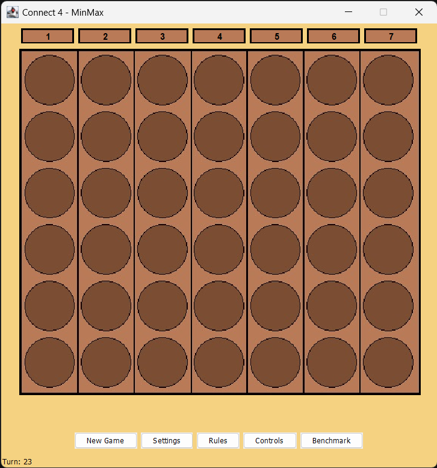
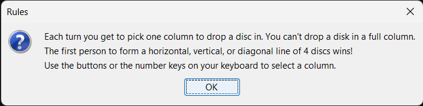
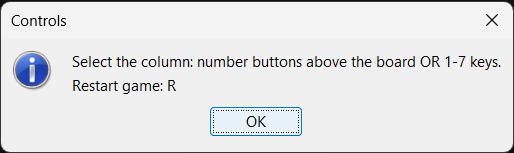
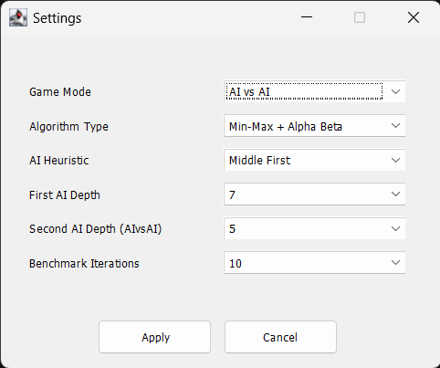
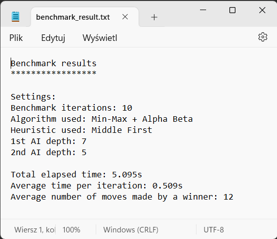

<a name="top"></a>

# Connect4 vs AI

<details>
  <summary>Table of Contents</summary>
  <ol>
    <li>
      <a href="#about-the-project">About The Project</a>
      <ul>
        <li><a href="#built-with">Built With</a></li>
      </ul>
    </li>
    <li>
      <a href="#getting-started">Getting Started</a>
      <ul>
        <li><a href="#prerequisites">Prerequisites</a></li>
        <li><a href="#installation">Installation</a></li>
        <li><a href="#run">Run</a></li>
      </ul>
    </li>
    <li>
      <a href="#usage">Usage</a>
      <ul>
        <li><a href="#instructions">Instructions</a></li>
        <li><a href="#rules">Rules</a></li>
        <li><a href="#controls">Controls</a></li>
        <li><a href="#settings">Settings</a></li>
        <li>
          <a href="#game-modes">Game Modes</a>
          <ul>
            <li><a href="#user-vs-ai">User vs AI</a></li>
            <li><a href="#user-vs-user">User vs User</a></li>
            <li><a href="#ai-vs-ai">AI vs AI</a></li>
          </ul>
        </li>
        <li><a href="#benchmarking">Benchmarking</a></li>
        <li><a href="#demo">Demo</a></li>
      </ul>
    </li>
  </ol>
</details>


## About The Project

This project contains an implementation of a well-known game <a href="https://en.wikipedia.org/wiki/Connect_Four">Connect 4</a>. It was originally created for a laboratory class as part of _Artificial Intelligence_ course at _Wrocław University of Science and Technology_. Therefore it includes a way to perform benchmarking of different AI configurations. The algorithm in question is <a href="https://en.wikipedia.org/wiki/Minimax">Minmax</a> with <a href="https://en.wikipedia.org/wiki/Alpha%E2%80%93beta_pruning">alpha-beta pruning</a>.

_For examples of use, please refer to the <a href="#usage">Usage</a> section._

### Built With


<p align="right">(<a href="#top">back to top</a>)</p>


## Getting Started

To get a copy of this project running on your machine follow these steps.

### Prerequisites

* Java Development Kit (JDK) installed

* IDE configured for development of Java applications _(I used Eclipse, other IDEs may require additional configuration steps to run the project)_

### Installation

1. Clone this repository:

   ```bash
   git clone https://github.com/macSro/Connect4-vs-AI.git
   ```

2. Open the project in Eclipse _(or other IDE, see Prerequisites)_

### Run

The simplest way to run the application is with the IDE's Run button or a keyboard shortcut _(Eclipse: Ctrl+F11)_.

<p align="right">(<a href="#top">back to top</a>)</p>


## Usage

The application offers the following GUI:

<div align="center">
  
</div>

### Instructions

* Each "1-7" button drops the disk into the selected column

* "New Game" button starts the new game (resets current)

* "Settings" button opens the <a href="#settings">Settings</a> pop-up

* "Rules" button opens the <a href="#rules">Rules</a> pop-up

* "Controls" button opens the <a href="#controls">Controls</a> pop-up

* "Benchmark" button starts <a href="#benchmarking">Benchmarking</a> according to the configuration setup in Settings

### Rules

<div align="center">
  
</div>

### Controls

<div align="center">
  
</div>

### Settings

<div align="center">
  
</div>


* _Game Mode_: User vs AI / User vs User / AI vs AI

* _Algorithm Type_: Min-Max / Min-Max + Alpha Beta

* _AI Heuristic_: Middle First / Random Equal / None

* _First AI Depth_: 1-10

* _Second AI Depth (AIvsAI)_: 1-10

* _Benchmark Iterations_: 1-50

### Game Modes

#### User vs AI

This game mode is selected by default. User always starts and then AI performs its turn. In order to change the difficulty _AAI Heuristic_ and _First AI Depth_ settings should be adjusted. Keep in mind, the higher you set AI depth, the more time AI needs to perform its turn. Don't "spam click" if it seems nothing's happening :) Adjusting _Algorithm Type_ to use Alha-beta pruning resolves in quicker "thinking" time.

#### User vs User

In this game mode, the application functions as a regular game to be played by two players. By turns, players drop their disks until one of them wins or the game is drawn.

#### AI vs AI

This game mode functions as a visualization of a game played by to AI instances. Setup their configurations via Settings and start a new game. You'll be able to watch in real time which moves they play and which one of them wins.

### Benchmarking

Benchmarking is basically performing multiple iterations of games between two AI instances. The number of iterations as well as AI characteristics can be configured in Settings. In contrast to AI vs AI game mode, the games are not visualized as Benchmarking should be used only to perform experiments. The results are then automatically saved in the ```benchmark``` directory of the project.

Here's an example of what data are acquired:

<div align="center">
  
</div>

### Demo

#### User vs AI
https://github.com/macSro/Connect4-vs-AI/assets/56345054/a339292d-69c3-4cff-83dd-b9d5f00fac68

#### AI vs AI
https://github.com/macSro/Connect4-vs-AI/assets/56345054/8ceaf664-5070-4e6b-a189-bf5c9c0d09b0

<p align="right">(<a href="#top">back to top</a>)</p>
